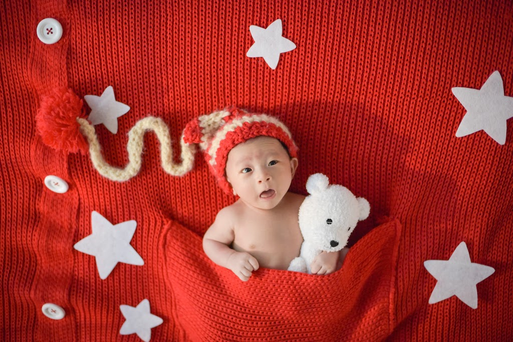

# Style Transfer with Keras

This is a Keras implementation of style transfer techniques described in the following paper:
- [Image Style Transfer Using Convolutional Neural Networks](https://www.cv-foundation.org/openaccess/content_cvpr_2016/papers/Gatys_Image_Style_Transfer_CVPR_2016_paper.pdf) by Leon A. Gatys, Alexander S. Ecker, Matthias Bethge

## Differences from the paper

All differences are marked with comments that start with '! the original paper ...'
- The CNN Model: VGG16 is used instead of VGG19. 
- The loss function for style representations: It is divided by (2. *  feature map size * channel number).
- The initial canvas: a content image.

They make better results on my implementation rather than the settings suggested by the original paper, empirically.

## Developed with
- Keras 2.1.2
- Python 3.6.3
- Python packages: numpy, scipy, PIL

## How to run
```bash
python style_transfer.py [options]
```

## Options
```bash
$ python style_transfer.py --help
usage: style_transfer.py [-h] [--content CONTENT] [--style STYLE]
                         [--output OUTPUT] [--iteration ITERATION]
                         [--loss_ratio LOSS_RATIO]
                         [--initialization {random,content,style}]
                         [--save_image_every_nth SAVE_IMAGE_EVERY_NTH]
                         [--verbose VERBOSE]

optional arguments:
  -h, --help            show this help message and exit
  --content CONTENT     The path of the content image (Default: './images/content/tubingen.jpg')
  --style STYLE         The path of the style image (Default: './images/style/shipwreck.jpg')
  --output OUTPUT       The directory path for results (Default: './outputs/')
  --iteration ITERATION
                        How many iterations you need to run (Default: 1000)
  --loss_ratio LOSS_RATIO
                        The ratio between content and style -> content / style (Default: 1e-3)
  --initialization {random,content,style}
                        The initial canvas (Default: 'content')
  --save_image_every_nth SAVE_IMAGE_EVERY_NTH
                        Save image every nth iteration (Default: 10)
  --verbose VERBOSE     Print reports (Default: True)
```

## File descriptions
```bash
├── image/
│   ├── content/ # content images
│   ├── style/ # style images
│   └── results/ # outcomes from style-transfer
├── style_transfer.py
└── utils.py
```

## Sample Results
All examples are obtained by default settings.

### Reproduction
The attempt to reproduce Figure 3 of the paper, which renders a photograph of the Neckarfront in Tübingen, Germany in the style of 5 different paintings. + You can see the generating progress video by clicking the image.
<p align="center">

<a href="http://www.youtube.com/watch?feature=player_embedded&v=t28Ph3AcW4s
         " target="_blank"></a>
<a href="http://www.youtube.com/watch?feature=player_embedded&v=Mdw70lntGaI
         " target="_blank"></a>
</p>

<p align="center">
<a href="http://www.youtube.com/watch?feature=player_embedded&v=aq217zlyBlc
         " target="_blank"></a>
<a href="http://www.youtube.com/watch?feature=player_embedded&v=l-I0gU3CrG0
         " target="_blank"></a>
<a href="http://www.youtube.com/watch?feature=player_embedded&v=nIvjrYaG3q4
         " target="_blank"></a>
</p>

Top Row (left to right): [No style](images/content/tubingen.jpg), [The Shipwreck of the Minotaur](images/style/shipwreck.jpg), [The Starry Night](images/style/starry-night.jpg)

Bottom Row (left to right): [Composition VII](images/style/kandinsky.jpg), [The Scream](images/style/the_scream.jpg), [Seated Nude](images/style/seated-nude.jpg)

### More trials
These are more trials on my son's photo. As above, the generating progress videos will be played by clicking the images.

<p align="center">

<a href="http://www.youtube.com/watch?feature=player_embedded&v=WLvGm49B5Vo
         " target="_blank"></a>
</p>

<p align="center">
<a href="http://www.youtube.com/watch?feature=player_embedded&v=AqL7rVArnjk
         " target="_blank"></a>
<a href="http://www.youtube.com/watch?feature=player_embedded&v=q1WJWg8HRQg
         " target="_blank"></a>
</p>

Top Row (left to right): [No style](images/content/my_son.JPG), [Girl before a mirror](images/style/girl_before_a_mirror.jpg)

Bottom Row (left to right): [Hokusai](images/style/hokusai.jpg), [훈민정음](images/style/hunminjungum.jpg)

## References
### Paper
- [Image Style Transfer Using Convolutional Neural Networks](https://www.cv-foundation.org/openaccess/content_cvpr_2016/papers/Gatys_Image_Style_Transfer_CVPR_2016_paper.pdf) by Leon A. Gatys, Alexander S. Ecker, Matthias Bethge

### Implementation
- [Keras examples](https://github.com/keras-team/keras/blob/master/examples/neural_style_transfer.py) by Keras Team
- [Keras based Neural Style Transfer](https://github.com/giuseppebonaccorso/Neural_Artistic_Style_Transfer) by giuseppebonaccorso
- [Fast AI's Deep learning course](https://github.com/fastai/courses/blob/master/deeplearning2/neural-style.ipynb) by Fast AI
- [Tensorflow Style-Transfer](https://github.com/hwalsuklee/tensorflow-style-transfer) by Hwalsuk Lee
- [TensorFlow (Python API) implementation of Neural Style](https://github.com/cysmith/neural-style-tf) by cysmith
